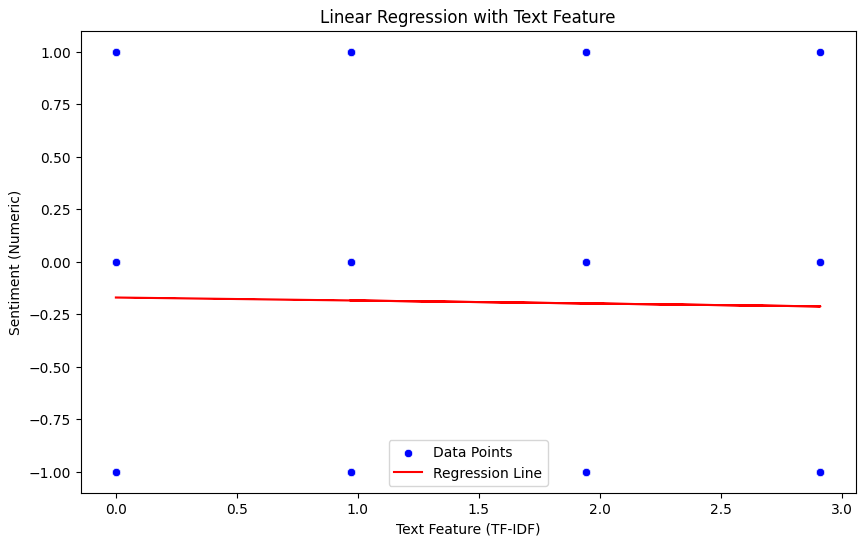
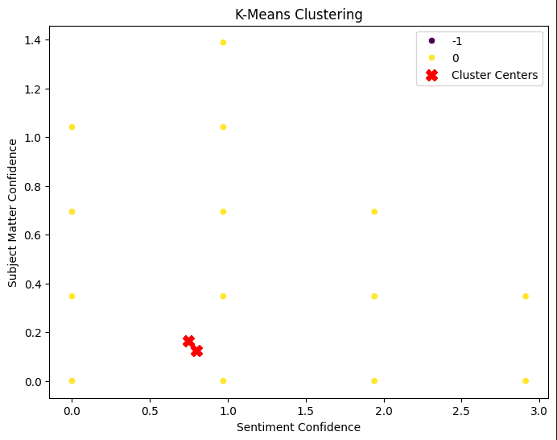
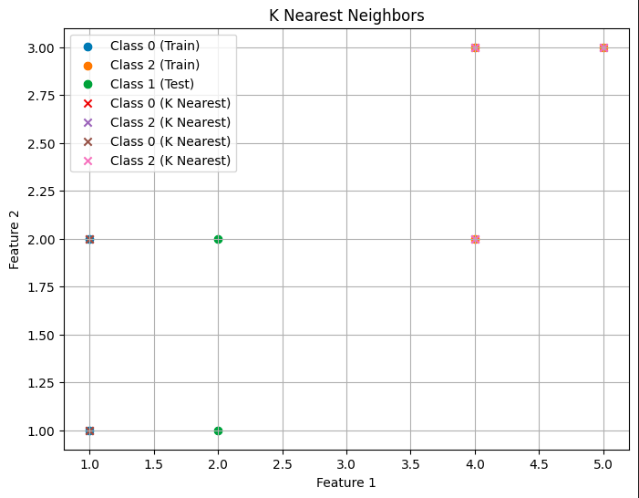

# Distributed Sentiment Analysis of Twitter Data Using Apache Spark: A Machine Learning Approach

Twitter Sentiment Analysis repository contains a project for performing sentiment analysis on Twitter data using Apache Spark.

## Contents

- `Sentiment_Analysis.ipynb`: Jupyter Notebook containing the code for the sentiment analysis.
- `Sentiment.csv`: The dataset file containing the Twitter data and sentiment labels.

## Project Overview

This project demonstrates how to use Apache Spark for sentiment analysis on Twitter data. The steps covered in the project include:

1. **Data Loading**: Reading the dataset into Spark DataFrame.
2. **Data Cleaning**: Preprocessing the data by handling missing values and performing necessary transformations.
3. **Feature Engineering**: Extracting features from the text data for model training.
4. **Model Training**: Training a machine learning model to classify the sentiment of tweets.
5. **Evaluation**: Evaluating the model's performance using appropriate metrics.

## Getting Started

### Prerequisites

- Apache Spark
- Jupyter Notebook
- Python
- Required Python libraries: `pandas`, `numpy`, `nltk`, `pyspark`

### Installation

1. Clone the repository:

   ```bash
   git clone https://github.com/burhanahmed1/Twitter-Sentiment-Analysis-Using-PySpark.git
   cd Twitter-Sentiment-Analysis-Using-PySpark
   pip install -r requirements.txt
   ```
2. Install the required Python libraries:
   ```bash
   pip install pandas numpy nltk pyspark
   ```
3. Start Jupyter Notebook:
   ```bash
   jupyter notebook
   ```

4. Open `Sentiment_Analysis.ipynb` in Jupyter Notebook and run the cells to execute the project.

### Results
The project demonstrates the effectiveness of using Apache Spark for sentiment analysis on large datasets. The final model achieves good accuracy in classifying the sentiment of tweets.
- The accuracy of the sentiment model using **Logistic Regression** is `0.62`
- Root Mean Squared Error (RMSE) and Explained Variance (R²) using **Linear Regression** are `0.7331581773635055` and `0.07966124788395001` respectively.
- The accuracy of the sentiment model using **Batch Gradient Descent** is `0.73`
- The accuracy of the sentiment model using **Schotastic Gradient Descent** is `0.75`

### Visualizations 
Data visualization techniques such as confusion matrices are used to evaluate the performance of the sentiment classification model and scatter plots are used to visualize the distribution and relationships of features in the dataset.

<div align="center">
  
  
  
  
  
</div>

## Contributing
Contributions are welcome! If you have any ideas, suggestions, or improvements, feel free to open an issue or submit a pull request.

## License
This project is licensed under the MIT License.

## Acknowledgments
Thanks to the open-source community for providing valuable tools and libraries.
